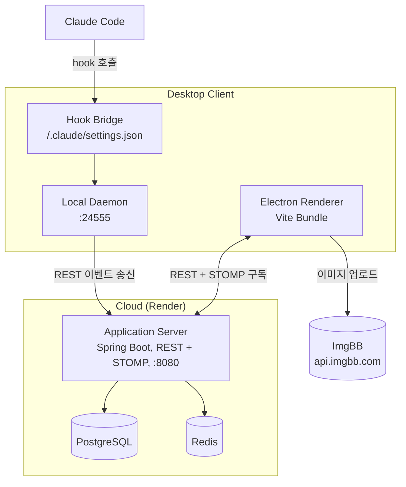

# Mohani (뭐하니)

> 동료들이 CLI에서 무슨 작업을 하는지, 토큰은 얼마나 쓰는지 real-time으로 확인할 수 있습니다~

[](https://www.npmjs.com/package/mohani)
[](https://github.com/Hwasowl/mohani/actions/workflows/publish-agent.yml)

---

## 0. 기능 소개

| 용어 | 의미 |
|---|---|
| **활동(Activity)** | AI CLI에서 사용자가 던진 프롬프트 한 건 — 전체 본문 + 도구 호출·결과까지 팀에 노출 |
| **이벤트(Event)** | 활동의 라이프사이클 단위 (`UserPromptSubmit` / `PreToolUse` / `PostToolUse` / `SessionStart` / `SessionEnd` / `Stop`) |
| **팀(Team)** | 팀 코드 6자(예: `ABC123`)로 식별되는 친구 그룹 |
| **피드(Feed)** | 팀원의 활동이 시간순으로 흐르는 라이브 스트림 — 프롬프트·도구 결과 전체가 보임 |
| **친구 그리드** | 팀원 카드 격자 — 활동 중/idle, 토큰 누적, 마지막 프롬프트 |
| **마스킹** | AWS/GCP 키, JWT, password, 이메일, 홈 경로 등 민감정보 자동 ●●● (공유 범위와 무관하게 항상 적용) |
| **비공개 모드** | 즉시 송신 차단 토글 — 다음 활동부터 팀에 안 보임 |

핵심 흐름: **친구가 Claude Code에서 무슨 질문을 던졌는지, 어떤 도구를 어떻게 호출했고 결과가 무엇이었는지** 거의 실시간으로 보임. 마스킹은 민감정보 한정으로 동작하고, 본인이 노출 자체를 끄고 싶으면 **비공개 모드**로 즉시 차단.

---

## 1. 시스템 아키텍처



| 요소 | 책임 |
|---|---|
| **Hook Bridge** | Claude Code의 `~/.claude/settings.json`에 안전 머지된 명령들 — 이벤트 진입점 |
| **Local Daemon** | Hook 이벤트 수신, **마스킹** 적용, **활동** 직렬화, 서버 송신 |
| **Electron Renderer** | **친구 그리드**·**피드**·**비공개 모드** 토글 UI — 라이브 피드는 STOMP 구독으로 수신 |
| **Application Server** | 인증·**팀**·**이벤트** 인제스트·STOMP 브로드캐스트 |
| **PostgreSQL** | **활동**·**팀**·계정 영속 저장 |
| **Redis** | 세션·통계 ZSET (실시간 토큰 누적·랭킹) |
| **ImgBB** | 채팅 이미지 외부 위임 — 서버는 이미지 바이트 무관 |

**모노레포 구조**:

| 폴더 | 무엇 |
|---|---|
| `backend/` | Spring Boot 3.4.3 + Redis + PostgreSQL — Application Server |
| `agent/` | Node 20 글로벌 npm `mohani` — Local Daemon + Hook Bridge + CLI |
| `electron/` | Electron + Vite + React + STOMP.js — Renderer |

---

## 2. 개발환경 Quick Start

### 사전 준비
- **Java 17** (`gradle.properties`에 JDK 17 경로 지정)
- **Node 20+**
- **Docker** (Postgres + Redis용)
- 빌드 디렉토리는 `C:/tmp/mohani-build` 로 우회 — OneDrive 한글 경로 회피

### 1) Persistence Tier
```bash
cd backend
docker compose up -d
```

### 2) Application Server
```bash
cd backend
./gradlew.bat bootRun
# → http://localhost:8080 listen
```

### 3) Local Daemon
```bash
cd agent
npm install
npm link            # mohani 명령을 전역 연결
npm start           # daemon이 :24555 listen
```

별도 터미널에서:
```bash
mohani login --name=화소 --backend=http://localhost:8080
mohani team create "데모팀"
# → "team code: ABC123" — 친구한테 공유
```

### 4) Renderer (Vite Dev Server + Electron 동시)
```bash
cd electron
npm install
npm run dev
```
Vite가 `:5173`에 dev server를 띄우고 Electron이 그 URL을 로드 → HMR 활성화.

### 5) Hook Bridge 등록 (개발 모드 한정)
글로벌 설치 시 자동 머지되지만, `npm link` 모드에선 한 번 수동 등록:

`~/.claude/settings.json`의 각 hook 배열에 추가:
```json
{
  "matcher": "",
  "hooks": [{
    "type": "command",
    "command": "node \"<레포경로>/mohani/agent/src/hook-cli.js\" --event=UserPromptSubmit"
  }]
}
```
이벤트 종류: `UserPromptSubmit`, `PreToolUse`, `PostToolUse`, `SessionStart`, `SessionEnd`, `Stop`.

### 6) 동작 확인
- A의 Claude Code에서 "redis sorted set 페이징 알려줘" 입력
- B의 Renderer **친구 그리드**에 A 카드 활성화 → 프롬프트·도구 결과·토큰 누적 표시
- A가 우상단 **비공개 모드** 토글 → B 화면에서 A 카드 idle 전환
- A가 비공개 해제 → 다음 활동부터 다시 노출
